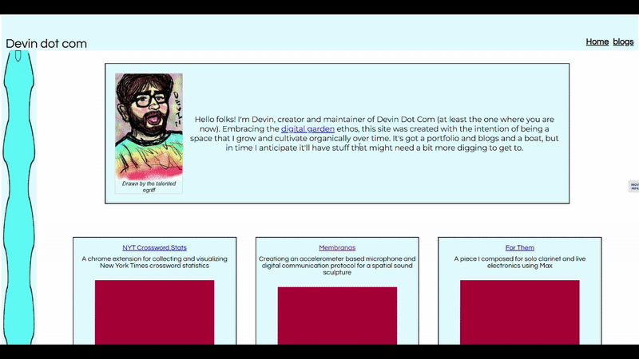
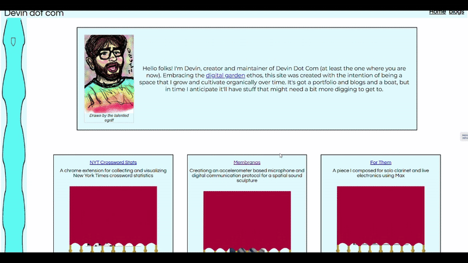
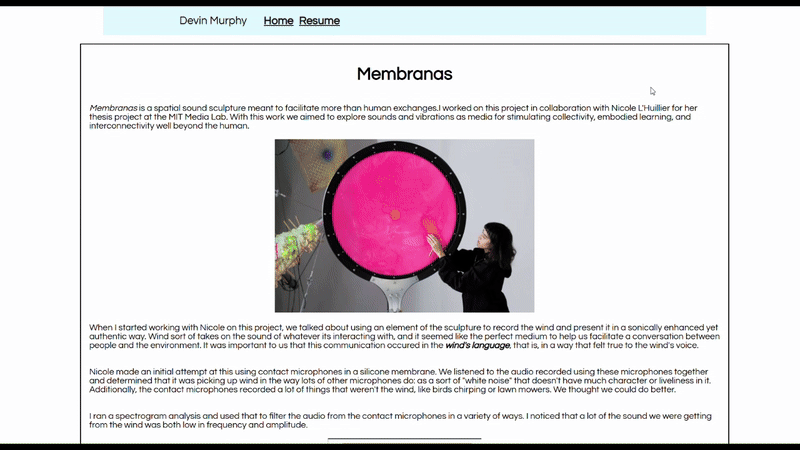
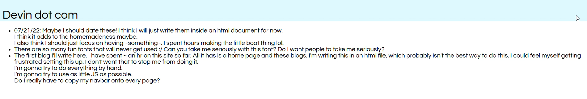
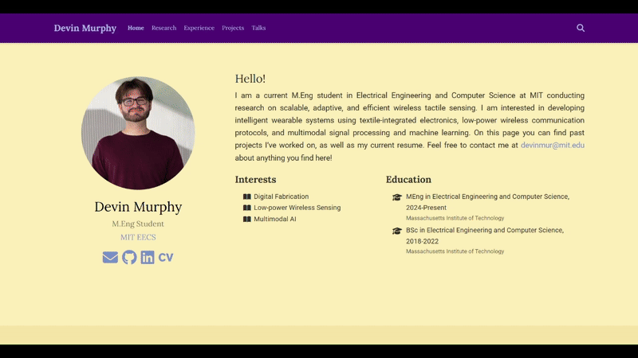
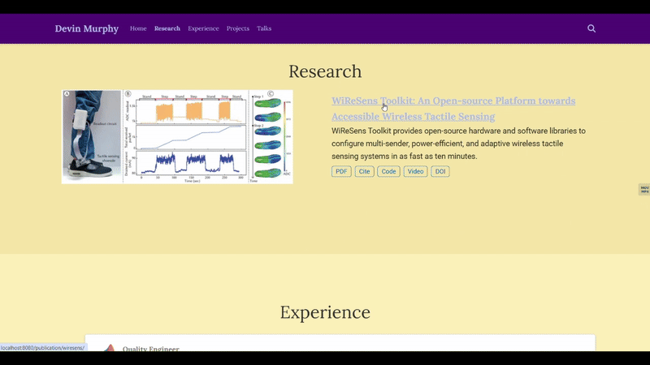

I spent the summer after I graduated with my Bachelor's degree in London with [MISTI](https://misti.mit.edu/), where I was working at a [startup](https://uk.yotoplay.com/) but mainly  experiencing living in a new country for the first time and meeting lots of new people. One guy I met there was really into the concept of a [digital garden](https://www.technologyreview.com/2020/09/03/1007716/digital-gardens-let-you-cultivate-your-own-little-bit-of-the-internet/). We talked about it at length, and he showed me his personal website (the garden he cultivated) as well as some others he really liked. 

I knew lots of peers built personal websites with the intention of impressing recruiters, but this wasn't enough to convince me to make one. Digital gardens on the other hand were fun - they didn't have to be perfect or presentable, just interesting enough for someone to stick around and learn something new about you. Many of the ones my London friend showed me used only html/css and looked the way we now associate with the "olden days" of the internet.

Like many gen Z'ers I grew up on social media and started to [question its influence](https://theharrispoll.com/briefs/gen-z-social-media-smart-phones/#:~:text=Nearly%20all%20have%20taken%20steps%20to%20limit%20their%20social%20media%20usage%20at%20some%20point.) on my day-day. I began thinking about a personal website as a way of broadcasting myself to the world on my own terms, and think this helped push me to finally make one.

### Personal Website 1

I was stubborn at the beginning, pledging to only use html and css with as little javascript as possible (I still think there are some [compelling reasons](https://indieweb.org/manual_until_it_hurts) for taking this approach). But pretty early on I started to feel 1) it wouldn't be sustainable for maintaining the site 2) I was limited in my expressiveness and 3) this wasn't really how people "did it" anymore, and I might as well learn more modern web frameworks. 

That led me to learning about React (for breaking my website down into reusable components), Parcel (for compiling and packaging my site), and Vercel (for deploying it).

The final site (which took shape over the course of about a year and four months according to my git commit history) looked like this: 

The left sidebar was a crude implementation of a boat following you on your journey through the page. The project teaser pictures all had these curtain animations that I made by animating an svg with keyframes:

At the time it was very much a portfoilio, with in depth descriptions of personal projects in a blog-like format: 

I had intended to use this as a place to host actual blogs as well, but only made it as far as this very first one which I think is an accurate summary of my attitudes toward the whole personal website thing at the time:

To edit the site, I had to make changes to various JSON configurations, run seperate compile scripts for the markdown and html, edit the blogs manually via html. It was kind of a headache. I do still use the Vercel infrastructure I set up here to automatically deploy my site upon pushing changes to GitHub so not all a wash.

#### In retrospect

- React is cool and taking the time to learn it has paid off, but it's probably not necessary for a personal website unless you want lots of interactivity beyond standard clicking and hovering
- Markdown is king when it comes to content management. Anything that you'll keep adding to (blogs/projects/publications) should probably use a template framework and only require you to edit markdown
- It's fun to experiment with styles and animations. There's a lot of joy in discovering how these things work for the first time and letting your imagination run wild. Eventually a day came where I wanted a more professional looking site and it took a lot of time to start over - if you think something like that could happen to you, maybe start designing with that in mind. 

### Personal Website 2

I kept my first website for about 2 years, until I started applying for PhD programs this past fall. As I got more involved in research during my M.Eng, I noticed that every PhD student seemed to have an academic website that followed a template. I started to appreicate the way these templates organized information and when I had submitted my first publications for review, I decided it would be a good time to adopt a more standard organization of my website and also use a framework that made updating the site less painful. 

I came across lots of templates ([this](https://github.com/alshedivat/al-folio), [this](https://github.com/HugoBlox/theme-academic-cv), or [this](https://jonbarron.info/)), but I ultimately chose the hugo theme because I liked how it looked and it seemed to offer more out-of-the-box customizability than the others. 

This is how the website looked:

I especially liked the ability to dissemninate all of the materials you put together for a paper submission in one spot:

#### In retrospect

- Switching to a template saved a lot of time. 
- During PhD interviews I was asked about information on my website that wasn't directly in my application. PI's don't have a lot of time, and I think having the important info in a format they were used to seeing made a difference. 
- Hugo made customization pretty difficult. It's a lot of setup between golang and the templates themselves. I wanted to add author lists to my publications and spent way too much time trying to figure out how.
- I think the layout is still doing too much (With age comes being boring and insufferable).

### Personal Website 3

The one you're looking at now!

I really liked the simplicity of [Pingchuan's template](https://pingchuan.ma/) (html/css and very minimal js) and thought it seemed pretty extensible. I changed some of the theme colors in the css, added a section to salvage parts of my project portfolio, and found the node package [11ty](https://www.11ty.dev/) which made it super easy to add blogs. I'm really liking how it's looking now, and feel pretty confident that the infrastructure is about as streamlined as it could be (one command to compile everything).

Currently I copy and paste blocks of html to add new publications or projects but I'm thinking about automating it with 11ty at some point. I also often get the urge to fill the whitespace in the margins with something more fun. When I have more blogs I think it'll make sense to tag and filter them. I should probably start using [Cursor](https://www.cursor.com/). But I'm satisfied for now, and I'm excited to see how this garden grows over the next few years. 

