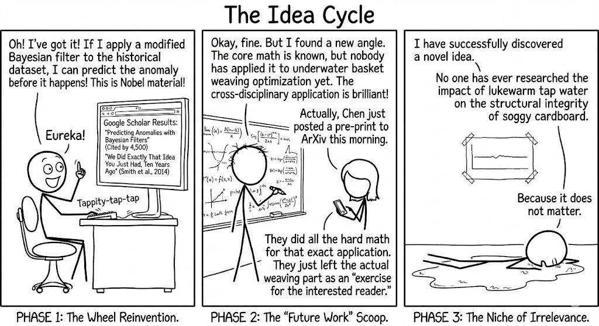

My experience so far is something like:

I have a brilliant idea! -> someone has already done it

I have a brilliant idea! -> someone has already done the cool part of it 

I have a brilliant idea! -> actually the idea is useless and doesn't move any needle in any interesting way

I asked gemini to make an xkcd comic illustrating this anguish and think it did a pretty good job honestly:

<figure>
  
  <figcaption>You get it, Gemini</figcaption>
</figure>

Here's to blind hope that there are still brilliant ideas left to be uncovered 🥂